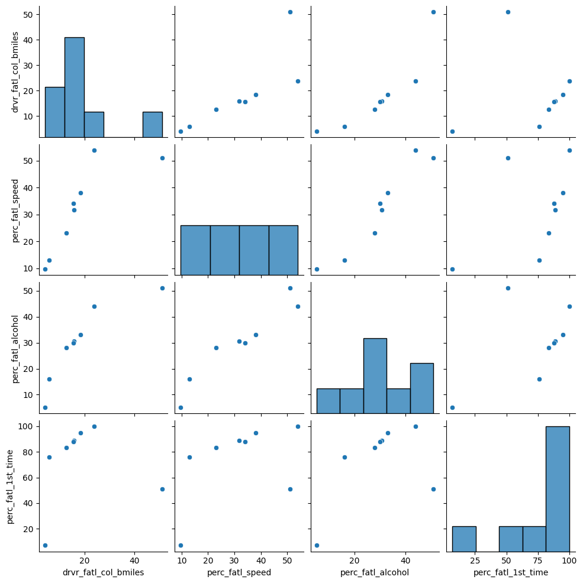

[](https://mybinder.org/v2/gh/ghassenhlaoui/Reducing-Traffic-Mortality-in-the-USA/HEAD)

# :mortar_board: Reducing-Traffic-Mortality-in-the-USA :mortar_board:

#### Context : Data Analysis Academic Project

We analyze data collected by the National Highway Traffic Safety Administration and the National Association of Insurance Commissioners to wrangle, plot, dimensionally reduce and cluster data to make an attempt to find patterns and help reduce Traffic Mortality in USA.

**How can we find a good strategy for reducing traffic-related deaths?**

**This Project was completed on DataCamp.**

## :file_folder: Project Description


While the rate of fatal road accidents has been decreasing steadily since the 80s, the past ten years have seen a stagnation in this reduction. Coupled with the increase in number of miles driven in the nation, the total number of traffic related-fatalities has now reached a ten year high and is rapidly increasing.

By looking at the demographics of traffic accident victims for each US state, we find that there is a lot of variation between states. Now we want to understand if there are patterns in this variation in order to derive suggestions for a policy action plan. In particular, instead of implementing a costly nation-wide plan we want to focus on groups of states with similar profiles. How can we find such groups in a statistically sound way and communicate the result effectively?


## :file_folder: Setup

<ul>
<li>Download the dataset</li>
<li>Download the Jupyter Notebook.</li>
</ul>

### Install the requirements

> - Install the pandas library using command pip install pandas.

> - Install the numpy library using command pip install numpy.

> - Make sure you use Python 3.

> - Run the jupyter notebook


### :file_folder: Libraries

During this project, we have used the following libraries  :
:point_down: :point_down:

<ul>
<li>NumPy : NumPy is a Python library used for working with arrays.</li>

<br> <br>
<li>Pandas : Pandas is an open source Python package that is most widely used for data science/data analysis and machine learning tasks. It is built on top of another package named Numpy, which provides support for multi-dimensional arrays.</li>

<br> <br>
<li>Matplotlib: Matplotlib is a plotting library available for the Python programming language as a component of NumPy, a big data numerical handling resource. Matplotlib uses an object oriented API to embed plots in Python applications.</li>

<br> <br>
<li>Seaborn : Seaborn is a Python data visualization library based on matplotlib. It provides a high-level interface for drawing attractive and informative statistical graphics.</li>

<br> <br>
<li>Sklearn : Scikit-learn is a key library for the Python programming language that is typically used in machine learning projects. Scikit-learn is focused on machine learning tools including mathematical, statistical and general purpose algorithms that form the basis for many machine learning technologies.</li>

</ul>


## :file_folder: Datasets

In our project we have used two datasets : **miles-driven.csv** , **road-accidents.csv**

## :file_folder: Project Tasks :point_down:
<ol>
<li>The raw data files and their format</li>
<li>Read in and get an overview of the data</li>
<li>Create a textual and a graphical summary of the data</li>
<li>Quantify the association of features and accidents</li>
<li>Fit a multivariate linear regression</li>
<li>Perform PCA on standardized data</li>
<li>Visualize the first two principal components</li>
<li>Find clusters of similar states in the data</li>
<li>KMeans to visualize clusters in the PCA scatter plot</li>
<li>Visualize the feature differences between the clusters</li>
<li>Compute the number of accidents within each cluster</li>
<li>Make a decision when there is no clear right choice</li>
</ol>


## :file_folder: Demonstration

By analysing our dataset **road-accidents.csv** we see :

#### 1- Read in and get an overview of the data


|    | state      |   drvr_fatl_col_bmiles |   perc_fatl_speed |   perc_fatl_alcohol |   perc_fatl_1st_time |
|---:|:-----------|-----------------------:|------------------:|--------------------:|---------------------:|
|  0 | Alabama    |                   18.8 |                39 |                  30 |                   80 |
|  1 | Alaska     |                   18.1 |                41 |                  25 |                   94 |
|  2 | Arizona    |                   18.6 |                35 |                  28 |                   96 |
|  3 | Arkansas   |                   22.4 |                18 |                  26 |                   95 |
|  4 | California |                   12   |                35 |                  28 |                   89 |

The columns are:

:small_orange_diamond: drvr_fatl_col_bmiles = Number of drivers involved in fatal collisions per billion miles (2011).

:small_orange_diamond: perc_fatl_speed = Percentage Of Drivers Involved In Fatal Collisions Who Were Speeding (2009).

:small_orange_diamond: perc_fatl_alcohol = Percentage Of Drivers Involved In Fatal Collisions Who Were Alcohol-Impaired (2011).

:small_orange_diamond: perc_fatl_1st_time = Percentage Of Drivers Involved In Fatal Collisions Who Had Not Been Involved In Any Previous Accidents (2011).
  
#### 2- Create a textual and a graphical summary of the data

Then we use ```.describe``` to return the description of the data and to view some basic statistical details like percentile, mean, std etc. we observe this:

|       |   drvr_fatl_col_bmiles |   perc_fatl_speed |   perc_fatl_alcohol |   perc_fatl_1st_time |
|:------|-----------------------:|------------------:|--------------------:|---------------------:|
| count |                51      |          51       |            51       |             51       |
| mean  |                15.7902 |          31.7255  |            30.6863  |             88.7255  |
| std   |                 4.122  |           9.63344 |             5.13221 |              6.96011 |
| min   |                 5.9    |          13       |            16       |             76       |
| 25%   |                12.75   |          23       |            28       |             83.5     |


The graphical overview is good to get a sense for the distribution of variables within the data and could consist of one histogram per column. It is often a good idea to also explore the pairwise relationship between all columns in the data set by using a pairwise **scatter plots**

The result is like this :



#### 3- Quantify the association of features and accidents 
We can already see some potentially interesting relationships between the target variable (the number of fatal accidents) and the feature variables (the remaining three columns).
now we can compute the Pearson correlation coefficient matrix to quantify correlation between variables. This is the output :

|                      |   drvr_fatl_col_bmiles |   perc_fatl_speed |   perc_fatl_alcohol |   perc_fatl_1st_time |
|:---------------------|-----------------------:|------------------:|--------------------:|---------------------:|
| drvr_fatl_col_bmiles |              1         |        -0.0290801 |            0.199426 |           -0.0179419 |
| perc_fatl_speed      |             -0.0290801 |         1         |            0.286244 |            0.0140662 |
| perc_fatl_alcohol    |              0.199426  |         0.286244  |            1        |           -0.245455  |
| perc_fatl_1st_time   |             -0.0179419 |         0.0140662 |           -0.245455 |            1         |

<p>the correlation table shows that the number of fatal accidents is most strongly correlated with alcohol consumption.</p>
<p>We have learned that alcohol consumption is weakly associated with the number of fatal accidents across states. This could lead us to conclude that alcohol consumption should be a focus for further investigations and maybe strategies should divide states into high versus low alcohol consumption in accidents.</p>

####  4- Perform PCA on standardized data

:bar_chart: One way to group the data is to use PCA (**Principal Component Analysis**)


<p>PCA uses the absolute variance to calculate the overall variance explained for each principal component; The cumulative variance of the first two principal components is 0.7947</p>
<p>So the proportion of the variation (79%) from all three features: speeding, alcohol influence, and first-time accidents.</p>

We will create a ```scatter plot``` of the first principle components and explore how the states cluster together in this visualization.


#### 5- Find clusters of similar states in the data
<p>It was not entirely clear from the PCA scatter plot how many groups in which the states cluster. To assist with identifying a reasonable number of clusters, we can use KMeans clustering by creating a scree plot and finding the "elbow", which is an indication of when the addition of more clusters does not add much explanatory power</p>


####  5- KMeans to visualize clusters in the PCA scatter plot

<p>Since there wasn't a clear elbow in the scater plot, let's see how the PCA scatter plot looks if we color the states according to the cluster to which they are assigned.</p>

<p>Kmeans to visualize the clusters in the pca , in our analysis we will assign the states in 3 groups</p> 


####  6- Compute the number of accidents within each cluster

<p>Since resources and time are limited, it is useful to start off with an intervention in one of the three groups first. Which group would this be? To determine this, we will include data on how many miles are driven in each state, because this will help us to compute the total number of fatal accidents in each state.</p>

 We will use **miles-driven.csv** 

|    | state      |   million_miles_annually |
|---:|:-----------|-------------------------:|
|  0 | Alabama    |                    64914 |
|  1 | Alaska     |                     4593 |
|  2 | Arizona    |                    59575 |
|  3 | Arkansas   |                    32953 |
|  4 | California |                   320784 |

<p>this is the result :</p>

|   cluster |   count |    mean |      sum |
|----------:|--------:|--------:|---------:|
|         0 |      18 | 911.406 | 16405.3  |
|         1 |      11 | 860.506 |  9465.57 |
|         2 |      22 | 898.379 | 19764.3  |

```Make a decision when there is no clear right choice```

:small_red_triangle_down:

<p>As we can see, there is no obvious correct choice regarding which cluster is the most important to focus on. Yet, we can still argue for a certain cluster and motivate this using our findings above. Which cluster do you think should be a focus for policy intervention and further investigation?</p>

I choose that cluster_num = 'perc_fatl_alcohol'

## :file_folder: Conclusion

After realizing this project we can conclude that this project lets us apply skills from:
:point_down: :point_down: :point_down:

> - **Introduction to Shell for Data Science,** including how to navigate the file system and view files
> - **pandas Foundations,** including reading, exploring, filtering, and grouping data
> - **Manipulating DataFrames with pandas,** including how to reshape data into the long format and how to perform multiple aggregations
> - **Merging DataFrames with pandas,** including how two merge two DataFrames
> - **Unsupervised Learning in Python,** including KMeans clustering, dimensionally reduction through PCA, and visualizations using matplotlib
> - **Supervised Learning with scikit-learn,** including multivariate regression
> - **Intermediate Python for Data Science,** including visualizations using matplotlib
> - **Data Visualization With Seaborn,** including statistical visualizations using seaborn

Copyrights : **Ghassene Helaoui**