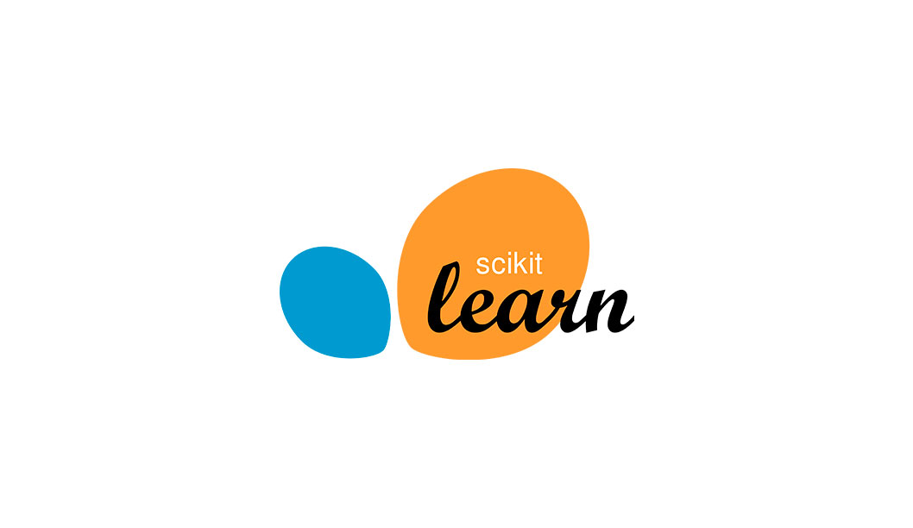

# Reducing-Traffic-Mortality-in-the-USA
=======

## Presentation

### Libraries
During this project, we have used the following libraries  :
<ul>
<li>NumPy : NumPy is a Python library used for working with arrays.</li>

 
<li>Pandas : Pandas is an open source Python package that is most widely used for data science/data analysis and machine learning tasks. It is built on top of another package named Numpy, which provides support for multi-dimensional arrays.</li>

 
<li>Matplotlib: Matplotlib is a plotting library available for the Python programming language as a component of NumPy, a big data numerical handling resource. Matplotlib uses an object oriented API to embed plots in Python applications.</li>

 
<li>Seaborn : Seaborn is a Python data visualization library based on matplotlib. It provides a high-level interface for drawing attractive and informative statistical graphics.</li>

 
<li>Sklearn : Scikit-learn is a key library for the Python programming language that is typically used in machine learning projects. Scikit-learn is focused on machine learning tools including mathematical, statistical and general purpose algorithms that form the basis for many machine learning technologies.</li>

 
</ul>

## Project

#### Reducing-Traffic-Mortality-in-the-USA

We analyze data collected by the National Highway Traffic Safety Administration and the National Association of Insurance Commissioners to wrangle, plot, dimensionally reduce and cluster data to make an attempt to find patterns and help reduce Traffic Mortality in USA.

### Datasets

In our project we have used two datasets : **miles-driven.csv** , **road-accidents.csv**